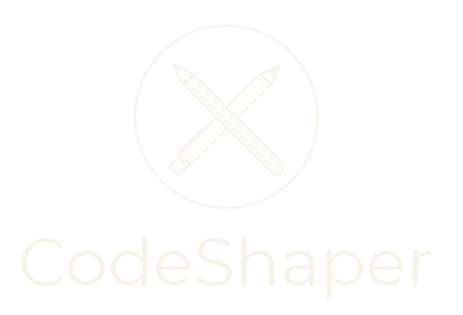

<p align="center">

</p>

### PROJECT IN DEVELOPMENT
___

 A tool to automate code changes using Regex and Antlr4

- Regex PCRE compliant using [PCRE.NET](https://github.com/ltrzesniewski/pcre-net)
- Antlr4 Grammars:
  - [CPP14 Grammars](https://github.com/antlr/grammars-v4/tree/master/cpp) 
  - [CSharp6 Grammars](https://github.com/antlr/grammars-v4/tree/master/csharp) (implementation in progress)

### Shaping
To shape a source code, you need a Shaping Project and a Source (only a Visual Studio Solution in C++ is supported)

Open CodeShaper executable, select Shape > Shape a Project and configurate the shaping options
and then shape source files, it will show the progression and the results,
you can easily check which changes were applied in detail


### Creating a Shaping Project
To create a shaping project, check the wiki (non-existent yet).


### Creating a Shaping Configuration
You can create a shaping configuration to make tests
quickly, using [HJSON](https://hjson.github.io/try.html) format

###### _ExampleShapingConfiguration.hjson_
``` json
{
    "name": Name of configuration
    "shape_project": Path of the Shape Project to test
    "source": Path of the Source to test
    "target": Directory for the shaping output
    "backup": Directory for backup (if specified 'Backup' option below
    "result": Result of the shaping
}
```

Notes:
 - name, shape_project. source and target are required properties
 - Backup property only needs to be specified if result is set to [Replace and Backup](https://github.com/OriDevTeam/CodeShaper/blob/9d6d056e88d06157897208277c0dba8991c36478/Lib/Configurations/ShapingConfiguration.cs#L37) option
 - Check [ResultOptions](https://github.com/OriDevTeam/CodeShaper/blob/9d6d056e88d06157897208277c0dba8991c36478/Lib/Configurations/ShapingConfiguration.cs#L31) Enum for result options


Place the configuration under `configs/` directory at the executable location,
after opening CodeShaper and selecting "Shape", select the option "Run a Shaping Configuration"
and select the shaping to run


## <span style="color:orange">Usability Warnings and Future Implementations Notes</span> 

#### Integrity checks
There is very few limited amount of checks for validations of paths, regex evaluations and HJSON/JSON integrity,
when developing shaping projects or simply using the application have in mind it can throw
exceptions regarding these points


#### Naming Actions
When writing any sort of Action (such as Builders, Replacements, Additions, etc...) be aware
that these should not have the same names, as it may end up overwriting each other
in expression matching

